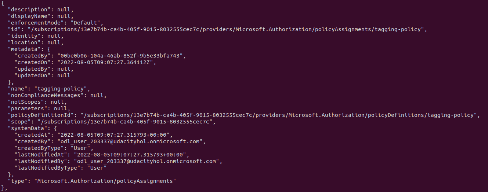
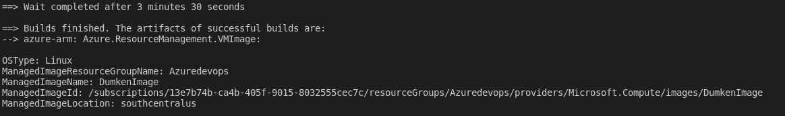
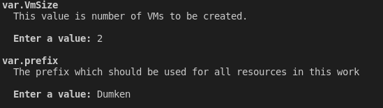
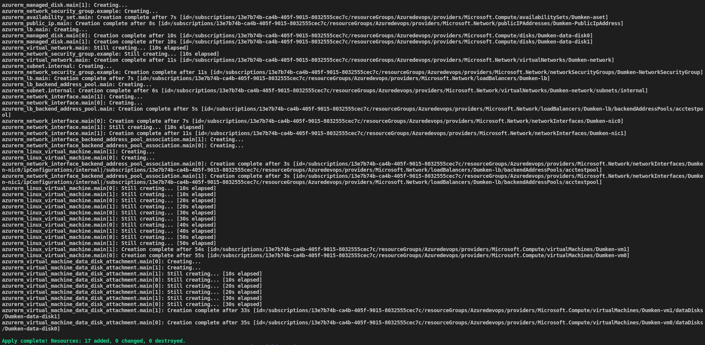

# Azure Infrastructure Operations Project: Deploying a scalable IaaS web server in Azure

### Introduction
For this project, you will write a Packer template and a Terraform template to deploy a customizable, scalable web server in Azure.

### Getting Started
1. Clone this repository

2. Create your infrastructure as code

3. Update this README to reflect how someone would use your code.

### Dependencies
1. Create an [Azure Account](https://portal.azure.com) 
2. Install the [Azure command line interface](https://docs.microsoft.com/en-us/cli/azure/install-azure-cli?view=azure-cli-latest)
3. Install [Packer](https://www.packer.io/downloads)
4. Install [Terraform](https://www.terraform.io/downloads.html)

### Instructions
After cloning this project
#### 1. Deploying Policy


Enter the Policy_folder using ```cd Udacity_Azure_Devops_Lab1/Policy_folder ```

You first have to create the policy using the command

```az policy definition create --name tagging-policy --display-name 'Allow Tags' --description 'This policy makes sure that the indexed resources are not created without a tag --mode Indexed' --rules tagging-policy.json```

Apply the policy to the subscription using 
```az policy assignment create --name tagging-policy --policy tagging-policy --scope /subscriptions/XXXX-XXXX-XXXX-XXXX ```

*Note: Use your subscription id on the area marked XXXX-XXXX-XXXX-XXXX to apply the policy to your subscription*

You should have a similar view as shown below



#### 2. Create a Linux image using Packer

First, determine your service principle credentials by entering the following command to get your client_id and client_secret

``` az ad sp create-for-rbac --query "{ client_id: appId, client_secret: password }" ```

To get your subscription Id use:

``` az account show --query "{ subscription_id: id }" ```

Persist the values in the environment variable using:

``` 
export ARM_CLIENT_ID=XXXX-XXXX-XXXX-XXXX 
export ARM_CLIENT_SECRET=XXXXXXXXXXXXXXXX 
export ARM_SUBSCRIPTION_ID=XXXX-XXXX-XXXX-XXXX 
```

To create a linux image using packer run the following command

``` packer build server.json```

If your image creation was successful, you should have a simlar output as shown below.



#### 3. Create and deploy Resources using terraform

- To create the resources, enter the terraform folder containing the main.tf and vars.tf.

```cd Udacity_Azure_Devops_Lab1/Terraform_folder ```

- Plan the Terraform resource deployment with 
``` 
terraform plan init
terraform plan -out solution.plan 
```

From the vars.tf, the variables are defined to implement **DRY**. But also you have the option of entering the Prefix name for your resources and the number of VMs you want. the number of VMs is set to be at most 5. The prompt output is as shown below.  



- create your resources with the command ``` terraform apply solution.plan ```

### Output
When the resources are created, you should have a similar view as shown below.


